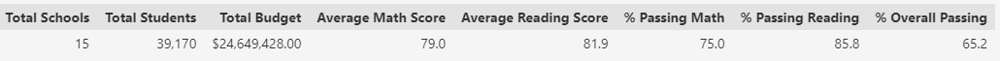
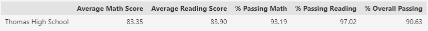
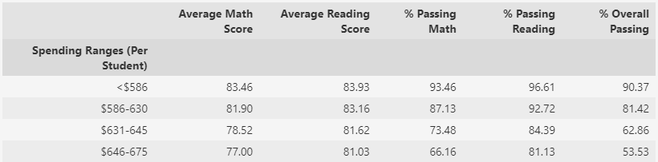
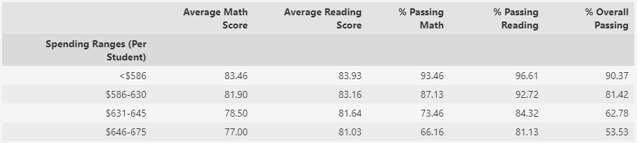
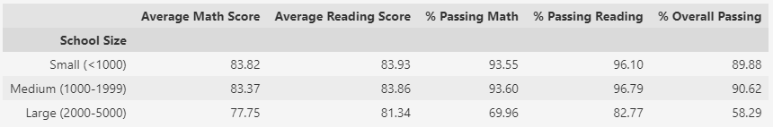
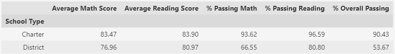

# School_District_Analysis
An analysis of standardized tests
 
 
## Overview of the school district analysis

After performing an analysis on the local school districts high school standardized testing scores, evidence of academic dishonesty was brought to light by the school board. According to what they know, the reading and math grades for ninth graders at Thomas High School are compromised. Since the inclusion of this bad data has probably given us an inaccurate district summary, this analysis aims to remove the compromised data from the dataset and redo the previous analysis with results that exclude the bad data. After the analysis is done, we can compare the results and see how the district summary was affected and perhaps confirm that the data had been tampered with if it falls to far from district averages.

 

## Results: 

### **How is the district summary affected?**

The school district as whole was **not significantly affected** by the bad scores. As we can see below, the old scores (upper) have nearly the same values as the scores adjusted for the removed data (lower). The makes sense; with 39,170 total students in the district the 9th graders at Thomas High school only make up roughly 1% of the total student base.

#### **Original** 

#### **After Reanalysis**

While the difference itself is quite small, it should be noted that the district comes out looking a little worse overall after reanalysis, meaning that the scores that were removed were most likely above average. It will be much easier to see the impact by looking at the change in the Thomas High School scores alone.
 
 
### **How is the school summary affected?**

The school itself felt a slightly greater impact from the removed scores but didn't change all that much. As we can see below, three of the values changed to lower scores and one, Average Reading Score, went slightly higher.

#### **Original** 

#### **After Reanalysis**

Seeing the difference here does not scream academic dishonesty, less than one half percent change is well within the standard deviation of individual student scores (which among math reading scores at Thomas High School alone was around 10% ). If the scores were compromised then they were not altered by much, at least not enough to conclude through the data alone. However it is worth pointing out the greatest change of these changes is in % Passing Reading at about .3%. It may still be worth it to see if replacing the scores altered Thomas High School standing in the district and see if any changes happened there.

### **How does replacing the ninth graders’ math and reading scores affect Thomas High School’s performance relative to the other schools?**

Due to the razor thin differences between the top Charter Schools, we can see a variety of outcomes after replacing the ninth grader's scores. Thomas High School's placement in Average Reading Scores, % Passing Math, and % Overall Passing did not change after replacing the scores. However there was a change of placement in two categories, from 4th in district to 6th in Average Math Scores, and from 1st in district to 3rd in % Passing Reading. On comparing the school summary changes above we saw that % Passing Reading was the most significant drop in score, and that definitely reflects here.

If there was academic dishonesty involved at Thomas High School, it is strange that the % Passing Reading went down after removing the scores while the Average Reading Score went up. One theory could be that the numbers were changed to bring failing students just above failing, lowering the average (compared to excluding them) and raising % passing

<!-- Changed from 4th to 6th in Average Math Scores
NOT Changted by Average Reading Scores
NOT changed by % Passing Math
Changed from first in district to last in % passing reading
NOt changed by % Overall Passing -->

### **How does replacing the ninth-grade scores affect the following:**
 

* Math and reading scores by grade
  
    Not unpredictably the changes in math reading scores by grade across the entire district have changed slightly to reflect the differences. **The average math score dropped from 80.35% to 80.12%** and **the average reading score dropped from 82.51% to 82.42%**. Note that while the average reading score for the school as a whole rose, it was not the case among district wide 9th graders

* Scores by school spending
  
    Scores by school spending changed slightly, as we can see below. The column of note is the $631-645 per student as this is the bracket that Thomas High School was in. The result is **an increase in reading scores and passing percentage** and **a decrease in math scores and passing percentages** as well as **a decrease in overall passing.**
     

    #### **Original** 
    

    #### **After Reanalysis**
    

* Scores by school size

    Scores by school size also had a very minor change in district wide performance. The category of note are the medium sized schools, as this is the category Thomas High School was in. Below we can see a minor improvement in average reading score, and a minor decrease in every other metric. This supports the idea that the the 9th grade reading scores were just above passing before they were removed.  

    #### **Original** 
    

    #### **After Reanalysis**
    

* Scores by school type

    By looking at the scores by school type we can see some of the least significant changes after reanalysis. Thomas High School is a charter school, and we can see below the very minor decreases in percentage passing math, reading, and overall.

    #### **Original** 
    

    #### **After Reanalysis**
    

## Summary: Summarize four changes in the updated school district analysis 

To summarize I will choose four of the most significant changes detailed above and highlight them here. Most significantly, the Thomas High Schools ranking among all schools in percentage passing reading went from 1st to 3rd. While there was still only a small difference in percent passing (.3%), this drop from first is in my opinion the most noteworthy difference in the analysis outcome. Second, the drop in rank from 4th to 6th in average math scores. These changes are more pronounced then the other because it changes Thomas High Schools position based of the most significant changes, the per school summary changes. In other categories, Thomas High school takes up to little of the total population to have other significant differences. On it's own, the change in Thomas High Schools overall scores is the another significant change. Overall the school faired worse than if it had kept the scores even if there was a small increase in average math score. These changes will affect the other students at Thomas High School more than changes to 9th graders across district, school type, or school size. Finally, pointing out how minutely the changes affected district wide numbers and even the Thomas High School's individual analysis. This a reassuring change as the small impact means the original analysis for the school board is mostly sound and the academic dishonesty is far from proven. It helps us conclude that whatever information the school board got can not exactly be corroborated by this analysis.